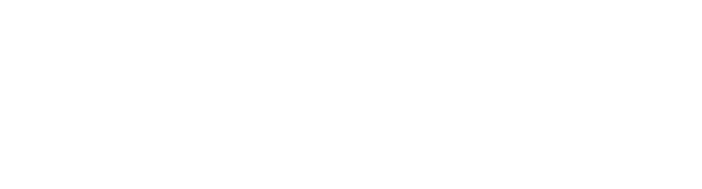

# 
Bienvenidos al FabLab de la Universidad de Valparaíso

  

  Laboratorio de desarrollo digital que ofrece espacio, herramientas y comunidad para innovadores y creadores. Este repositorio sirve como índice para los proyectos desarrollados dentro de nuestra comunidad.

---

## Proyectos

Explora los proyectos realizados cada año y descubre las innovaciones del FabLab UV:

  <table>
    <tr>
      <td align="center">
        <a href="/Proyectos/2022/README.md">
          <strong>Proyectos 2022</strong>
        </a>
      </td>
      <td align="center">
        <a href="/Proyectos/2023/README.md">
          <strong>Proyectos 2023</strong>
        </a>
      </td>
      <td align="center">
        <a href="/Proyectos/2024/README.md">
          <strong>Proyectos 2024</strong>
        </a>
      </td>
      <td align="center">
        <a href="/Proyectos/2025/README.md">
          <strong>Proyectos 2025</strong>
        </a>
      </td>
      <td align="center">
        <a href="/Proyectos/2026/README.md">
          <strong>Proyectos 2026</strong>
        </a>
      </td>
    </tr>
  </table>

---

## 🚀 ¿Tienes un proyecto en mente?

En **FabLab UV**, siempre estamos buscando nuevas ideas y oportunidades para colaborar. Si estás trabajando en un proyecto innovador, necesitas apoyo técnico o estás desarrollando una tesis, ¡queremos escucharte!

🔧 **Proyectos Estudiantiles:** ¿Eres estudiante y tienes una idea o proyecto que te gustaría desarrollar? Contamos con las herramientas y el equipo para ayudarte a hacer realidad tu visión.

🎓 **Apoyo a Tesistas:** Si estás trabajando en tu tesis y necesitas ayuda con la creación de prototipos, desarrollo digital, o simplemente un espacio de trabajo creativo, el FabLab es el lugar ideal.

🤝 **Colaboración con Proyectos Externos:** Organizaciones, empresas y emprendedores también son bienvenidos a colaborar con nosotros. ¡Lleva tu proyecto al siguiente nivel con nuestro equipo!

Para más información o consultas, no dudes en contactarnos. Juntos podemos convertir tus ideas en realidad:

📧 [fablab@uv.cl](mailto:fablab@uv.cl)
